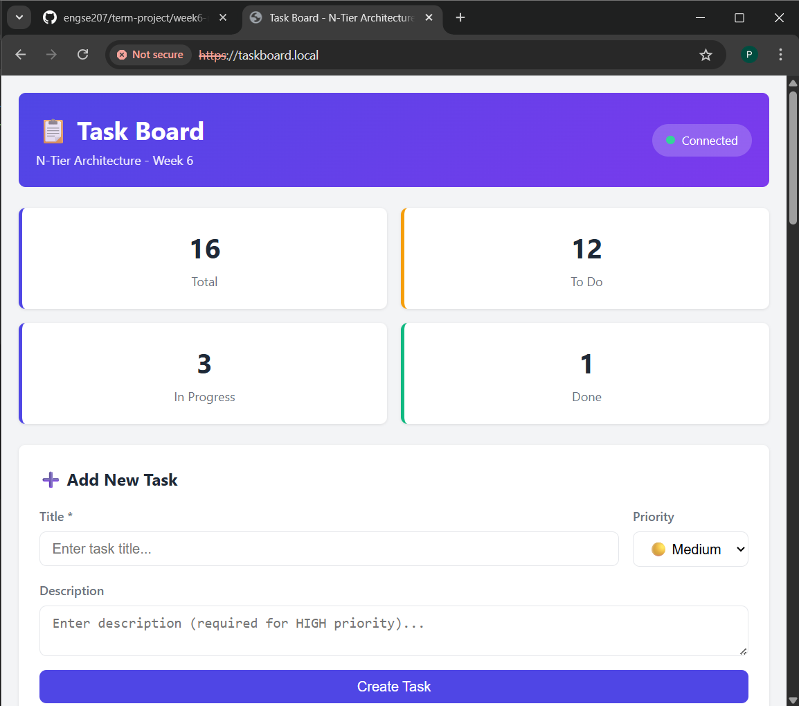

# ENGSE207 สัปดาห์ที่ 6 - กระดานงานสถาปัตยกรรม N-Tier



## คุณสมบัติ (Features)

- การดำเนินการสร้าง (Create), อ่าน (Read), อัปเดต (Update), และลบ (Delete) (CRUD) สำหรับงาน
- เปลี่ยนสถานะของงาน
- รับสถิติของงาน
- จุดสิ้นสุด (endpoint) สำหรับตรวจสอบสถานะสุขภาพ (Health check)

## ชุดเทคโนโลยี (Technology Stack)

- **ส่วนหลังบ้าน (Backend):** Node.js, Express.js
- **ฐานข้อมูล (Database):** PostgreSQL
- **เว็บเซิร์ฟเวอร์ (Web Server):** Nginx (สำหรับใช้งานจริง)
- **ส่วนหน้าบ้าน (Frontend):** HTML, CSS, JavaScript

## โครงสร้างโปรเจกต์ (Project Structure)

โปรเจกต์นี้มีโครงสร้างเป็นสถาปัตยกรรม N-Tier โดยมีเลเยอร์ (layers) ดังต่อไปนี้:

- **เลเยอร์การนำเสนอ (Presentation Layer):** `public/` (HTML, CSS, JS) และ `routes/` (เส้นทาง API)
- **เลเยอร์ธุรกิจ (Business Layer):** `services/` (ตรรกะทางธุรกิจ)
- **เลเยอร์การเข้าถึงข้อมูล (Data Access Layer):** `repositories/` (การดำเนินการฐานข้อมูล)
- **เลเยอร์โมเดล (Model Layer):** `models/` (โครงสร้างข้อมูล)
- **การกำหนดค่า (Configuration):** `config/` (การเชื่อมต่อฐานข้อมูล)
- **มิดเดิลแวร์ (Middleware):** `middleware/` (การจัดการข้อผิดพลาด, การตรวจสอบความถูกต้อง)

## การตั้งค่าและการรันแอปพลิเคชัน (Setup and Running the Application)

1.  **โคลนที่เก็บ (clone the repository):**
    ```bash
    git clone git@github.com:Panuwat-ta/engse207-solo.git
    ```
2.  **ติดตั้งสิ่งที่ต้องพึ่งพา (install dependencies):**
    ```bash
    npm install
    ```
3.  **ตั้งค่าตัวแปรสภาพแวดล้อม (set up environment variables):**
    สร้างไฟล์ `.env` ในไดเรกทอรีรูทและเพิ่มตัวแปรต่อไปนี้:
    ```
    PORT=3000
    DB_USER=your_db_user
    DB_HOST=localhost
    DB_DATABASE=your_db_name
    DB_PASSWORD=your_db_password
    DB_PORT=5432
    ```
4.  **เริ่มต้นฐานข้อมูล (initialize the database):**
    รันสคริปต์ `database/init.sql` เพื่อสร้างตาราง `tasks` ในฐานข้อมูล PostgreSQL ของคุณ
5.  **เริ่มแอปพลิเคชัน (start the application):**
    ```bash
    npm start
    ```
    เซิร์ฟเวอร์จะเริ่มทำงานที่ `http://localhost:3000`
    
    #### test api
    

## จุดสิ้นสุด API (API Endpoints)

มีจุดสิ้นสุด (endpoints) ต่อไปนี้:

- `GET /api/health`: ตรวจสอบสถานะสุขภาพ (Health check)
- `GET /api/tasks`: รับงานทั้งหมด
- `GET /api/tasks/stats`: รับสถิติของงาน
- `GET /api/tasks/:id`: รับงานเดียวตาม ID
- `POST /api/tasks`: สร้างงานใหม่
- `PUT /api/tasks/:id`: อัปเดตงาน
- `PATCH /api/tasks/:id/status`: อัปเดตสถานะของงาน
- `PATCH /api/tasks/:id/next`: ย้ายงานไปยังสถานะถัดไป
- `DELETE /api/tasks/:id`: ลบงาน

