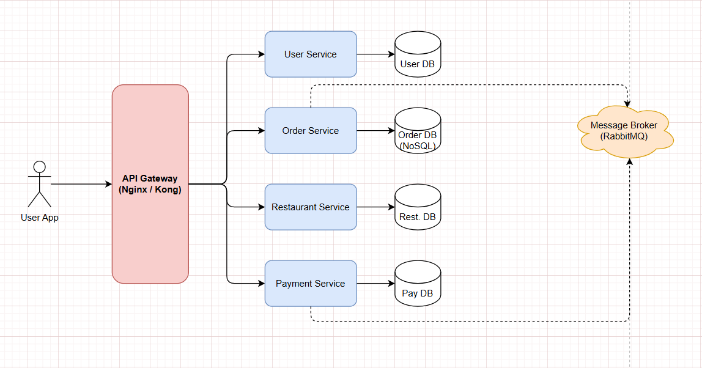

# Architecture Decision Record (ADR)
## 🎯 วัตถุประสงค์
1. ฝึกการวิเคราะห์ Requirements และแปลงเป็น Architectural Drivers
2. ฝึกการสร้าง Candidate Architectures และเปรียบเทียบ Trade-offs
3. ฝึกการเขียน ADR อย่างเป็นระบบ
4. เตรียมความพร้อมสำหรับ Term Project

## ระบบ Online Food Ordering (สั่งอาหารออนไลน์)
- ลูกค้าสั่งอาหารจากร้านต่างๆ
- ติดตามสถานะการจัดส่งแบบ Real-time
- ชำระเงินผ่าน QR Code/Credit Card

---

### วิเคราะห์ Requirements

**สิ่งที่ต้องทำ:**
1. เขียน Functional Requirements (อย่างน้อย 5 ข้อ)
2. เขียน Non-Functional Requirements (อย่างน้อย 3 ข้อ)
3. ระบุ Constraints (อย่างน้อย 3 ข้อ)
4. เขียน Quality Attribute Scenarios (อย่างน้อย 2 อัน)

**Template:**

## Requirements Analysis

### Functional Requirements
1. ผู้ใช้สามารถค้นหาร้านอาหารและเมนูอาหารได้
2. ผู้ใช้สามารถเพิ่ม/ลด/ลบรายการอาหารในตะกร้าได้
3. ผู้ใช้สามารถชำระเงินผ่านช่องทางต่างๆ ได้ (Credit Card, QR Code)
4. ผู้ใช้สามารถติดตามสถานะของออเดอร์ได้แบบ Real-time (เช่น กำลังเตรียมอาหาร, กำลังจัดส่ง)
5. ร้านค้าสามารถจัดการเมนูและรับออเดอร์ได้

### Non-Functional Requirements
1. **Performance:** ระบบต้องตอบสนองการค้นหาเมนูภายใน 2 วินาที
2. **Scalability:** ระบบต้องรองรับผู้ใช้พร้อมกัน 10,000 คนในช่วงเวลาเร่งด่วน (เที่ยง, ตอนเย็น) ได้โดยไม่ล่ม
3. **Availability:** ระบบต้องมีความพร้อมใช้งาน (Uptime) 99.9%

### Constraints
1. **Technology:** ทีมพัฒนาคุ้นเคยกับ JavaScript (Node.js, React) เป็นอย่างดี
2. **Budget:** งบประมาณสำหรับ Cloud Infrastructure ถูกจำกัดอยู่ที่ 15,000 บาท/เดือน ในช่วงแรก
3. **Time:** phase แรกของโครงการต้องเสร็จสิ้นภายใน 3 เดือน

### Quality Attribute Scenarios

#### Scenario 1: High Traffic during Lunch Time
- **Quality Attribute:** Scalability
- **Source:** ผู้ใช้จำนวนมาก
- **Stimulus:** ผู้ใช้ 10,000 คนเข้าใช้งานพร้อมกันเพื่อสั่งอาหารตอนเที่ยง
- **Artifact:** ระบบทั้งหมด
- **Environment:** Normal operation
- **Response:** ระบบสามารถขยาย (Scale out) เพื่อรองรับโหลดที่เพิ่มขึ้นได้อัตโนมัติ
- **Response Measure:** Latency ของการทำ Transaction ต้องไม่เกิน 3 วินาที และไม่มี request ที่ล้มเหลวเกิน 0.1%

#### Scenario 2: Payment Gateway Failure
- **Quality Attribute:** Reliability
- **Source:** ระบบ Payment Gateway ภายนอก
- **Stimulus:** Payment Gateway ของธนาคารล่มหรือไม่ตอบสนอง
- **Artifact:** ส่วนของบริการชำระเงิน (Payment Service)
- **Environment:** ขณะที่ผู้ใช้กำลังจะชำระเงิน
- **Response:** ระบบแจ้งเตือนผู้ใช้ว่าช่องทางการชำระเงินนี้ใช้ไม่ได้ชั่วคราว และแนะนำให้ลองใหม่หรือเลือกช่องทางอื่น
- **Response Measure:** ระบบตรวจจับความล้มเหลวได้ภายใน 15 วินาทีและแจ้งเตือนผู้ใช้ทันทีโดยไม่ทำให้ข้อมูลออเดอร์เสียหาย

---

### ออกแบบ Candidate Architectures

**สิ่งที่ต้องทำ:**
1. ออกแบบ 2 Candidate Architectures
2. แต่ละ Architecture ต้องมี:
   - ชื่อและคำอธิบายสั้นๆ
   - รายชื่อ Components หลัก
   - Technologies/Tools ที่จะใช้
   - Architectural Patterns
   - Diagram (วาดด้วย Draw.io หรือเครื่องมืออื่น)
   - ข้อดีข้อเสีย

**Template:**

## Candidate Architecture 1: Monolithic Architecture

### Overview
เป็นสถาปัตยกรรมแบบดั้งเดิมที่ทุกส่วนของแอปพลิเคชัน (UI, Business Logic, Data Access) ถูกรวมไว้ในหน่วยเดียวกันทั้งหมด ง่ายต่อการพัฒนาและ Deploy ในช่วงแรก แต่ดูแลรักษายากเมื่อระบบใหญ่ขึ้น

### Components
- **Web Server:** ให้บริการ Frontend (React) และเป็น Gateway สำหรับ API
- **Application Core:** ประกอบด้วยทุก Logic ของระบบ เช่น User Management, Order Management, Payment Processing, Restaurant Management
- **Database:** ฐานข้อมูล SQL กลางสำหรับเก็บข้อมูลทั้งหมด

### Technology Stack
- Frontend: React
- Backend: Node.js (Express)
- Database: PostgreSQL
- Others: Nginx (Reverse Proxy)

### Architectural Patterns
- Monolithic
- Layered Architecture

### Diagram
[แทรกรูป Architecture Diagram ของ Monolith]
*สมมติว่าเป็นรูปภาพไดอะแกรม*

### Pros & Cons
**Pros:**
- ✅ ง่ายต่อการพัฒนาและเริ่มต้น (Simple to develop)
- ✅ ง่ายต่อการ Deploy ในช่วงแรก (Single deployment unit)
- ✅ การทดสอบ End-to-End ทำได้ง่ายกว่า

**Cons:**
- ❌ แก้ไขและ Deploy ยากเมื่อระบบใหญ่ขึ้น (High coupling)
- ❌ ขยายระบบ (Scale) ได้ยาก ต้องขยายทั้งก้อน
- ❌ Technology Stack ถูกจำกัดอยู่แบบเดียว

---

## Candidate Architecture 2: Microservices Architecture

### Overview
เป็นสถาปัตยกรรมที่แบ่งแอปพลิเคชันออกเป็นบริการย่อยๆ (Services) ที่ทำงานเป็นอิสระต่อกัน แต่ละบริการมีหน้าที่รับผิดชอบเฉพาะด้านและสามารถพัฒนา, Deploy, และ Scale ได้อย่างอิสระ

### Components
- **API Gateway:** เป็นประตูหลักในการรับ request จากภายนอกและกระจายไปยัง Service ที่เหมาะสม
- **User Service:** จัดการข้อมูลผู้ใช้และการยืนยันตัวตน
- **Order Service:** จัดการการสร้างและติดตามออเดอร์
- **Payment Service:** จัดการการชำระเงิน
- **Restaurant Service:** จัดการข้อมูลร้านค้าและเมนู
- **Notification Service:** จัดการการส่งแจ้งเตือน (Email/Push)
- **Service Registry/Discovery:** ช่วยให้ Service ต่างๆ ค้นหากันเจอ

### Technology Stack
- Frontend: React
- Backend: Node.js (Express/Fastify) สำหรับแต่ละ Service
- Database: PostgreSQL (สำหรับ User/Restaurant), MongoDB (สำหรับ Order)
- Others: Nginx (API Gateway), RabbitMQ (Message Broker), Docker, Kubernetes

### Architectural Patterns
- Microservices
- API Gateway
- Database per Service
- Service Discovery

### Diagram

- User ส่งข้อมูลเข้า API Gateway

- Gateway กระจายงานไปยัง Services ทั้ง 4

- Service แต่ละตัวคุยกับ Database ของตัวเองเท่านั้น

- หากมีการทำงานเบื้องหลัง (เช่น สั่งอาหารเสร็จแล้ว) Service จะส่งข้อมูลเส้นประลงมาที่ Message Broker

### Pros & Cons
**Pros:**
- ✅ ขยายระบบ (Scale) ได้ง่ายและยืดหยุ่น (Scalable)
- ✅ แต่ละทีมดูแล Service ของตัวเองได้ (Independent teams)
- ✅ เลือกใช้เทคโนโลยีที่เหมาะสมกับแต่ละ Service ได้ (Technology freedom)

**Cons:**
- ❌ ซับซ้อนในการจัดการและดูแล
- ❌ การทดสอบและการ Debug ทำได้ยากกว่า
- ❌ ต้องมี Infrastructure ที่ดี

---

### Evaluate & Select

**สิ่งที่ต้องทำ:**
1. สร้างตารางเปรียบเทียบ 2 Architectures
2. ให้คะแนนและน้ำหนัก
3. เลือก 1 Architecture พร้อมเหตุผล

**Template:**

## Evaluation

### Comparison Table

| Criteria | Weight | Arch 1: Monolith (Score) | Arch 1 (Weighted) | Arch 2: Microservices (Score) | Arch 2 (Weighted) |
|---|---|---|---|---|---|
| Scalability | 30% | 2 | 0.6 | 5 | 1.5 |
| Maintainability (Long-term) | 20% | 2 | 0.4 | 4 | 0.8 |
| Development Speed (Initial) | 20% | 5 | 1.0 | 2 | 0.4 |
| Cost (Infrastructure) | 15% | 4 | 0.6 | 2 | 0.3 |
| Team Autonomy | 15% | 1 | 0.15 | 5 | 0.75 |
| **Total** | **100%** | | **2.75** | | **3.75** |

### Selected Architecture
**Decision:** Microservices Architecture

**Reasons:**
1. **Scalability is Key:** รองรับ Quality Attribute Scenario เรื่อง High Traffic ได้ดีกว่าอย่างชัดเจน ซึ่งเป็นหัวใจของธุรกิจ Food Delivery
2. **Long-term Maintainability:** ถึงแม้จะซับซ้อนกว่า แต่การแบ่งเป็น Service ย่อยๆ ทำให้ดูแลรักษาง่ายกว่าในระยะยาวเมื่อทีมและฟีเจอร์ขยายตัว
3. **Team Autonomy:** เปิดโอกาสให้ทีมย่อยสามารถพัฒนาและ Deploy ได้อย่างอิสระ ซึ่งจะช่วยเพิ่มความเร็วในการส่งมอบฟีเจอร์ในอนาคต

---

### เขียน ADR
**ADR Template:**

# ADR-001: Architectural Style for Online Food Ordering System

**Date:** 2026-01-17 
**Status:** Accepted 
**Deciders:** supakit rakboot 

---

## Context

### Background
กำลังจะสร้างระบบสั่งอาหารออนไลน์ ซึ่งคาดว่าจะมีผู้ใช้จำนวนมากในช่วงเวลาเร่งด่วน เช่น ตอนเที่ยงและตอนเย็น ระบบต้องสามารถขยายตัวเพื่อรองรับโหลดที่เพิ่มขึ้น และต้องง่ายต่อการเพิ่มฟีเจอร์ใหม่ๆ ในอนาคต

### Problem Statement
เลือกสถาปัตยกรรมหลักสำหรับระบบ ซึ่งจะมีผลต่อความสามารถในการขยายตัว (Scalability), การบำรุงรักษา (Maintainability), และความเร็วในการพัฒนาทั้งในระยะสั้นและระยะยาว

### Key Drivers
- **Functional:**
  - Real-time order tracking
  - Multiple payment options
- **Quality Attributes:**
  - **Scalability:** รองรับผู้ใช้พร้อมกัน 10,000 คน
  - **Availability:** Uptime 99.9%
  - **Maintainability:** ง่ายต่อการเพิ่มฟีเจอร์ใหม่ๆ โดยไม่กระทบส่วนอื่น
- **Constraints:**
  - ทีมคุ้นเคยกับ JavaScript
  - ต้อง Deploy phase แรกใน 3 เดือน

---

## Decision

We will use **Microservices Architecture**.

### Components
- **API Gateway:** Single entry point for all clients.
- **User Service:** Manages user data and authentication.
- **Order Service:** Manages order creation and tracking.
- **Payment Service:** Manages payment processing.
- **Restaurant Service:** Manages restaurant and menu data.
- **Notification Service:** Manages notifications (Email/Push).
- **Service Registry/Discovery:** For service-to-service communication.

### Technologies
- Frontend: React
- Backend: Node.js (Fastify) for each service
- Database: PostgreSQL, MongoDB (Database per Service)
- Others: Kubernetes, Docker, RabbitMQ (for asynchronous communication)

### Architectural Patterns
- Microservices, API Gateway, Database per Service, Service Discovery

---

## Rationale

### Why this decision?
1. **Superior Scalability:** Microservices ช่วยให้เราสามารถ Scale เฉพาะ Service ที่จำเป็นได้ เช่น เมื่อมีโปรโมชั่น อาจจะ Scale แค่ Order Service และ Restaurant Service ซึ่งตอบโจทย์เรื่อง High Traffic ได้ดีที่สุด
2. **Technology Flexibility:** ถึงแม้ Constraint จะบอกว่าทีมคุ้นเคยกับ JavaScript แต่สถาปัตยกรรมนี้เปิดโอกาสให้เราเลือกใช้เทคโนโลยีอื่น (เช่น Go, Python) สำหรับบาง Service ที่ต้องการ Performance สูงในอนาคตได้
3. **Improved Fault Isolation:** หาก Payment Service ล่ม จะไม่กระทบกับการทำงานของระบบส่วนอื่น ผู้ใช้ยังสามารถดูเมนูหรือสร้างออเดอร์ (แต่จ่ายเงินไม่ได้) ซึ่งดีกว่า Monolith ที่อาจจะล่มทั้งระบบ

### Alternatives Considered
1. **Monolithic Architecture**
   - Pros: พัฒนาและ Deploy ได้เร็วกว่าในตอนแรก
   - Cons: Scale ยาก, ดูแลรักษาระยะยาวซับซ้อน, Technology-locked
   - Why not chosen: ไม่ตอบโจทย์ด้าน Scalability ซึ่งเป็น Driver ที่สำคัญที่สุด

---

## Consequences

### Positive (ข้อดี)
- ✅ ระบบมีความยืดหยุ่นและขยายตัวได้สูง
- ✅ แต่ละทีมทำงานได้อย่างอิสระและรวดเร็วขึ้น (ในระยะยาว)
- ✅ ง่ายต่อการทดลองและนำเทคโนโลยีใหม่ๆ มาใช้

### Negative (ข้อเสีย)
- ❌ ความซับซ้อนในการจัดการเพิ่มขึ้น → Mitigation: ใช้ Kubernetes และ Monitoring Tools ที่ดี
- ❌ ค่าใช้จ่ายด้าน Infrastructure ในช่วงแรกอาจสูงกว่า → Mitigation: เริ่มต้นด้วย Cluster ขนาดเล็กและใช้ Autoscaling
- ❌ การทดสอบแบบ End-to-End ทำได้ยากขึ้น → Mitigation: ลงทุนในการทำ Contract Testing และ Integration Testing ที่ดี

### Risks
- ⚠️ **Operational Overhead:**
  - Impact: High
  - Probability: Medium
  - Mitigation: จัดตั้งทีม Platform/DevOps เพื่อดูแล Infrastructure โดยเฉพาะ

### Trade-offs
- **Development Speed vs. Scalability:** เรายอมแลกความเร็วในการพัฒนาช่วงแรกที่ช้าลง เพื่อความสามารถในการ Scale ที่ดีกว่าในอนาคต

---

## Compliance

### Constraints Met
- ✅ **JavaScript Stack:** สามารถเริ่มต้นพัฒนาทุก Service ด้วย Node.js และ React ได้ตามความถนัดของทีม
- ✅ **Time to Market:** ถึงแม้จะซับซ้อน แต่สามารถเลือกเฉพาะ Service ที่จำเป็นก่อนได้ ภายใน 3 เดือน

### Quality Attributes Addressed
- ✅ **Scalability:** เป็นเหตุผลหลักที่เลือกสถาปัตยกรรมนี้
- ✅ **Maintainability:** การแบ่งเป็น Service ทำให้ง่ายต่อการแก้ไขและดูแลในระยะยาว

---

## Notes

### Assumptions
- เราจะมีทีม DevOps หรือ Platform Engineer เพื่อมาดูแลความซับซ้อนของ Infrastructure

### Future Considerations
- อาจพิจารณาใช้ Service Mesh (เช่น Istio, Linkerd) ในอนาคตเพื่อจัดการ Communication ระหว่าง Service ให้ดีขึ้น

### References
- NestJS Documentation: [Application Context & Modules](https://docs.nestjs.com/)

- Modular Monolith: [Microservices](https://www.borntodev.com/2020/05/22/microservices-%E0%B8%84%E0%B8%B7%E0%B8%AD%E0%B8%AD%E0%B8%B0%E0%B9%84%E0%B8%A3/) 

- nginx Reverse Proxy: [Nginx](https://nginx.org/)
- RabbitMQ: [RabbitMQ](https://www.rabbitmq.com/docs)
- Docker: [Docker](https://www.docker.com/)
---
